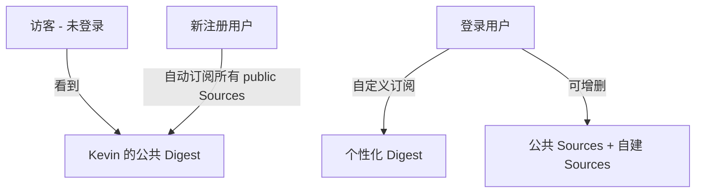
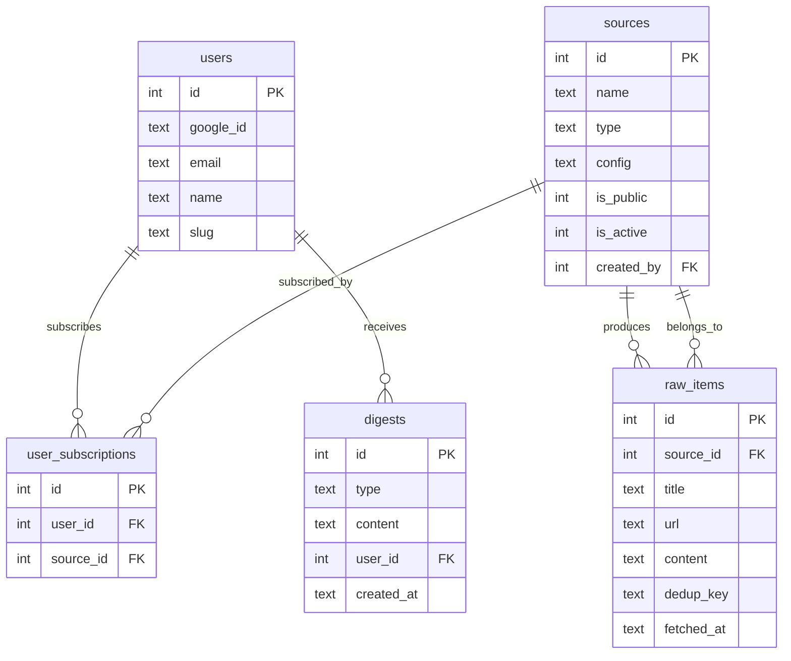
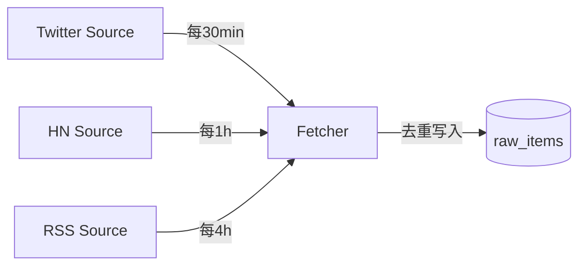
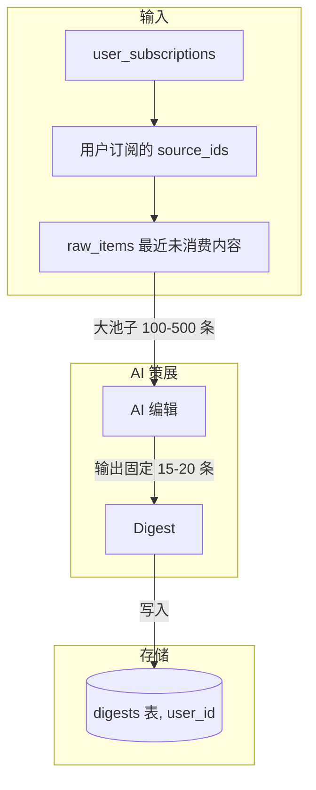

# AI Digest 多租户架构设计

> AI Digest 从个人工具升级为公开 SaaS 服务的架构设计文档。

## 1. 产品理念

### "AI 编辑部" vs "RSS Reader"

| | RSS Reader | AI 编辑部 |
|---|---|---|
| Source 增多 | 未读越积越多，焦虑 | 筛选池变大，质量更高 |
| 输出量 | = 输入量 | **固定**（15-20 条/期） |
| 用户心智 | "我要看完所有内容" | "AI 帮我挑最值得看的" |
| Source 角色 | 内容来源 | **线人网络** |
| Digest 角色 | 信息流 | **编辑精选** |

核心公式：**Source 越多 → 筛选池越大 → 输出质量越高 → 篇幅不变**

用户不需要担心"订阅太多"，因为 Digest 长度固定。就像报纸的版面是固定的——记者（Source）越多，选题质量越高，但报纸还是那么厚。

## 2. 用户层级



| 层级 | 看到的内容 | 可操作 |
|---|---|---|
| 未登录 | 站长 Kevin 的公共 Digest | 只读 |
| 新注册 | 同上（自动订阅站长的"默认推荐包"） | 增删 Sources |
| 登录用户 | 按自己订阅池生成的 Digest | 增删 Sources，管理订阅 |

新注册用户自动订阅站长的"默认推荐包"（Default Pack），而非所有 public Sources。初始体验 = 未登录体验，零配置即可开始。

### Source 的定义与粒度

**Source = 一个可独立采集的数据流**，是 Digest 的最小信息输入单位。

| 示例 | Source 类型 | 说明 |
|---|---|---|
| Kevin 的 Twitter For You feed | `twitter_feed` | 算法推荐的时间线 |
| Kevin 的 Twitter Bookmarks | `twitter_bookmarks` | 用户手动收藏的内容 |
| 某个 Twitter List | `twitter_list` | 一组账号的聚合 |
| Hacker News Front Page | `hackernews` | HN 热门帖子 |
| 某个 RSS 订阅 | `rss` | 一个 blog/newsletter 的 feed |
| Reddit r/LocalLLaMA | `reddit` | 一个 subreddit |
| GitHub Trending | `github_trending` | 每日热门 repo |

**粒度原则：**
- ✅ 一个 RSS feed = 一个 Source
- ✅ 一个 Twitter List = 一个 Source
- ✅ 一个 subreddit = 一个 Source
- ❌ 单个 Twitter 账号 ≠ 一个 Source（太细了，那就变 RSS reader 了）
- 粒度类似"一个信息频道"，不是"一个人"

## 3. 数据模型

### 现有表

- `sources` — 信息源定义（name, type, config, is_public, is_active, created_by）
- `digests` — 生成的摘要（type, content, metadata, user_id, created_at）
- `marks` — 用户书签/标记
- `users` — 用户（google_id, email, name, avatar, slug）
- `sessions` — 登录会话
- `source_packs` — Source 打包分享

### 新增表

#### `raw_items` — 采集的原始内容

```sql
CREATE TABLE IF NOT EXISTS raw_items (
  id INTEGER PRIMARY KEY AUTOINCREMENT,
  source_id INTEGER NOT NULL REFERENCES sources(id) ON DELETE CASCADE,
  title TEXT NOT NULL DEFAULT '',
  url TEXT NOT NULL DEFAULT '',
  author TEXT DEFAULT '',
  content TEXT NOT NULL DEFAULT '',
  fetched_at TEXT NOT NULL DEFAULT (datetime('now')),
  published_at TEXT,
  dedup_key TEXT NOT NULL,            -- source_id + url 或 content hash
  metadata TEXT DEFAULT '{}',         -- 点赞数、评论数等原始信号
  UNIQUE(source_id, dedup_key)
);
CREATE INDEX idx_raw_items_source_fetched ON raw_items(source_id, fetched_at DESC);
CREATE INDEX idx_raw_items_fetched ON raw_items(fetched_at DESC);
```

#### `user_subscriptions` — 用户订阅关系

```sql
CREATE TABLE IF NOT EXISTS user_subscriptions (
  id INTEGER PRIMARY KEY AUTOINCREMENT,
  user_id INTEGER NOT NULL REFERENCES users(id) ON DELETE CASCADE,
  source_id INTEGER NOT NULL REFERENCES sources(id) ON DELETE CASCADE,
  created_at TEXT NOT NULL DEFAULT (datetime('now')),
  UNIQUE(user_id, source_id)
);
CREATE INDEX idx_user_subs_user ON user_subscriptions(user_id);
```

### 现有表改动

```sql
-- digests: user_id 字段已存在但均为 NULL，无需 DDL 变更
-- 仅需在生成 Digest 时写入 user_id

-- sources: is_public 字段已存在，无需变更
```

### ER 图



## 4. 采集架构

### 核心原则：Source 级采集，与用户无关

同一个 Source 不管有多少人订阅，只采集一次。采集结果存入 `raw_items`，供所有订阅者共享。



### 采集频率

| Source 类型 | 频率 | 原因 |
|---|---|---|
| Twitter | 30 min | 时效性强 |
| Hacker News | 1 h | 热度变化较快 |
| Reddit | 1 h | 同上 |
| RSS / Blog | 4 h | 更新频率低 |
| Newsletter | 被动接收 | 邮件触发 |

### 去重策略

`dedup_key = source_id + ":" + url`（URL 相同即去重）。无 URL 的内容使用 content hash。

通过 `UNIQUE(source_id, dedup_key)` 约束，`INSERT OR IGNORE` 即可跳过重复。

## 5. Digest 生成流程



### 生成步骤

1. **取订阅源**：查 `user_subscriptions` 得到用户的 `source_id` 列表
2. **取原始内容**：从 `raw_items` 中取这些 source 在上次 Digest 之后的新内容
3. **AI 策展**：将 100-500 条候选内容发给 LLM，要求输出固定篇幅（15-20 条精选）
4. **存储**：写入 `digests` 表，关联 `user_id`

### 订阅组合共享（Phase 3 优化）

如果多个用户的订阅组合完全相同，可以共享 Digest 结果：

```
subscription_hash = SHA256(sorted(source_ids).join(','))
```

生成前先查是否已有相同 hash 的 Digest，有则直接复用。

### 递归摘要

| 周期 | 输入 | 保留策略 |
|---|---|---|
| 4H | raw_items | 原始精选 |
| Daily | 当天所有 4H Digest | 合并去重，保留 Top 15-20 |
| Weekly | 7 天 Daily | 周度精华 |
| Monthly | 4 周 Weekly | 月度回顾 |

## 6. Sources 页面信息架构

### 当前问题

Sources 页面混杂了三个不同概念：
- "My Sources"（我创建的）
- "Public Sources"（所有人的公开源，和 My Sources 重复）
- "Source Packs"（分享包）

用户进来不知道该干嘛。

### 核心模型：创建 vs 订阅

```
创建 Source ≠ 订阅 Source

我创建了一个 RSS Source（→ sources 表, created_by = me）
我订阅了这个 Source（→ user_subscriptions 表）
别人也可以订阅我的 public Source
```

### 页面结构

```
┌─────────────────────────────────────────┐
│  📡 我的信息源                            │
│                                         │
│  ┌─ 已订阅 ──────────────────────────┐  │
│  │ ✅ Twitter For You    [⏸️] [✕]    │  │
│  │ ✅ Hacker News        [⏸️] [✕]    │  │
│  │ ✅ AI Blogs RSS       [⏸️] [✕]    │  │
│  └───────────────────────────────────┘  │
│                                         │
│  [+ 添加 Source]  [🔍 探索更多]          │
│                                         │
│  ┌─ 我创建的 ────────────────────────┐  │
│  │ 📡 AI Blogs RSS   public  [编辑]  │  │
│  │ 📡 My Private RSS private [编辑]  │  │
│  └───────────────────────────────────┘  │
└─────────────────────────────────────────┘
```

**已订阅**（核心区域）：
- 决定 Digest 内容池的 Sources
- 每个可以暂停（不退订但暂时不采集）或退订
- 包括自己创建的 + 别人的公开 Source + 从 Pack 安装的

**添加 Source**：
- URL 检测（现有功能）→ 创建并自动订阅
- 手动添加 → 创建并自动订阅

**探索更多**：
- 跳到 Source Market / Packs 浏览页
- 发现别人分享的公开 Sources 和 Packs
- 一键订阅

**我创建的**（折叠区域）：
- 我创建的所有 Sources（不管有没有订阅）
- 可以编辑、设置 public/private、删除
- 和"已订阅"可能有重叠，但角色不同

### 空状态（新用户）

```
📡 选择你的信息源
AI 编辑部会从这些源中为你精选内容。
源越多，筛选质量越高，但你收到的 Digest 篇幅不变。

[🚀 安装推荐包，快速开始]     ← 站长的 Default Pack
[+ 自己添加 Source]

━━━━━━━━━━━━━━━━━━━━━
📦 推荐 Packs
┌────────────────────────────┐
│ 🏷️ Kevin's AI Sources      │
│ 📰🔶🐦 · 5 Sources · Install│
└────────────────────────────┘
```

### "探索" 页面（Phase 3 Source Market）

```
🔍 探索 Sources

🔥 热门 Packs
  [Kevin's AI Sources] [Crypto Daily] [Tech News]

📂 按类型浏览
  🐦 Twitter (12)  📡 RSS (34)  🔶 Reddit (8)  📡 HN (3)

🆕 最新公开 Sources
  · AI Blogs RSS — by Kevin · 23 subscribers
  · r/LocalLLaMA — by Alice · 15 subscribers
```

## 7. 呈现

### 板块结构

```
📰 AI Digest — 2026-02-22 Daily

🐦 Twitter 精选 (5)
  · @karpathy: LLM 推理优化新思路...  [via: AI Twitter]
  · @elonmusk: SpaceX Starship 更新...  [via: Elon Musk]

📡 Hacker News (4)
  · Show HN: 用 SQLite 跑分布式系统  [via: HN Front Page]
  · Ask HN: 2026 年最佳 CLI 工具?     [via: HN Front Page]

🔶 Reddit (3)
  · r/LocalLLaMA: Llama 4 benchmark 出了  [via: Reddit AI]

📝 Blogs & RSS (3)
  · Simon Willison: Claude 的新工具模式    [via: AI Blogs]

━━━━━━━━━━━━━━━━━━━━━
🧹 建议取关 (owner only)
  · @某低质量账号 — 最近 30 天 0 条入选

🔖 Bookmarks (owner only)
  · 用户标记的内容
```

### 关键规则

- **Digest 总量固定**（15-20 条），不随 Source 数量膨胀
- 每条标注来源 Source
- 按 Source 类型（twitter / hn / reddit / rss）分板块
- 私人板块（🧹建议取关、🔖Bookmarks）仅 owner 可见

## 7. 迁移计划

### Phase 1: raw_items + 采集管道

- [ ] 创建 migration `006_raw_items.sql`
- [ ] 实现 `raw_items` 的 CRUD 函数（db.mjs）
- [ ] 重构现有采集逻辑，采集结果写入 `raw_items` 而非直接生成 Digest
- [ ] Digest 生成从 `raw_items` 读取

**目标**：采集与生成解耦，Source 只抓一次。

### Phase 2: user_subscriptions + 个性化 Digest

- [ ] 创建 migration `007_subscriptions.sql`
- [ ] 实现订阅管理 API
- [ ] 注册时自动订阅所有 public Sources
- [ ] Digest 生成按用户订阅组合筛选 raw_items
- [ ] Digest 写入时关联 user_id
- [ ] 前端：订阅管理 UI

**目标**：每个用户有个性化 Digest。

### Phase 3: 成本优化

- [ ] 计算 subscription_hash，相同订阅组合共享 Digest
- [ ] 缓存策略：相同 hash 在同一时段只生成一次
- [ ] 监控：统计独立订阅组合数量，优化覆盖率

**目标**：降低 LLM 调用成本。

## 8. API 变更

### 新增 Endpoints

| Method | Path | 说明 |
|---|---|---|
| GET | `/api/subscriptions` | 获取当前用户的订阅列表 |
| POST | `/api/subscriptions` | 订阅 Source `{ sourceId }` |
| DELETE | `/api/subscriptions/:sourceId` | 取消订阅 |
| POST | `/api/subscriptions/bulk` | 批量订阅 `{ sourceIds: [] }` |
| GET | `/api/raw-items` | 查看采集的原始内容（调试用） |
| GET | `/api/raw-items/stats` | 各 Source 采集统计 |

### 修改 Endpoints

| Method | Path | 变更 |
|---|---|---|
| GET | `/api/digests` | 增加按 `user_id` 过滤；未登录返回 Kevin 的 Digest |
| POST | `/api/digests` | 生成时关联 `user_id`，基于订阅组合筛选 raw_items |
| GET | `/api/sources` | 新增 `subscribed` 参数，返回用户是否已订阅 |
| POST | `/api/sources` | 创建后自动为创建者添加订阅 |
| GET | `/feed/:slug` | 返回该用户的个性化 Digest feed |

### 认证要求

- `/api/subscriptions/*` — 需要登录
- `/api/raw-items/*` — 需要登录 + admin（调试用）
- 其他现有 API 行为不变，新增 user_id 感知

## 9. 产品 Roadmap

### 已完成 ✅

- **v0.1–v0.5** — 基础 Digest 浏览、SQLite 存储、i18n、Google OAuth、Sources CRUD、Source Packs 分享、JSON/RSS Feed、Mark 收藏

### 近期 🔨

| 优先级 | 功能 | 说明 |
|--------|------|------|
| P0 | **Soft Delete Sources** | 软删除避免 pack zombie；is_deleted 标记，pack install 跳过已删源 |
| P0 | **Multi-tenant Phase 1** | raw_items 表 + 采集管道，Source 级采集与 Digest 生成解耦 |
| P1 | **Multi-tenant Phase 2** | 基于用户订阅组合生成个性化 Digest |
| P1 | **Sources 集成 Cron** | Cron 读取 `/api/sources?active=true` 而非硬编码 Twitter |

### 中期方向 🧭

#### 1. AI Agent Embed
嵌入 AI 编辑助理（Chat Widget），让用户可以与 Digest 内容互动：
- 右下角气泡式 Chat Box
- 行为感知：观察用户浏览模式，主动推荐
- 问答：针对当期 Digest 内容深入追问
- 场景示例："这条新闻的背景是什么？" "帮我追踪这个话题"

#### 2. Agent Friendly
让整个系统对 AI Agent 友好，降低自动化接入门槛：
- 结构化 API 输出（JSON Schema 规范）
- MCP Server 支持（让 Claude/GPT agent 直接操作 Digest）
- Webhook 回调（Source 更新、Digest 生成完成事件通知）
- 幂等操作设计（agent 重试安全）

#### 3. Channel 推送
Digest 通过多渠道主动分发，用户选择接收方式：
- **Telegram Bot** — 定时推送 + 按需查询
- **Feishu/Lark** — 群机器人 / DM 推送
- **Email** — 定期邮件摘要（daily/weekly）
- **Slack** — Webhook / Bot 集成
- **Discord** — Channel 推送
- **RSS/JSON Feed** — 已完成 ✅
- 用户维度：每人可选推送渠道 + 频率偏好

### 远期 🔭

| 功能 | 说明 |
|------|------|
| **Source Market** | 社区 Source 发现页，热门 Pack 推荐，分类浏览 |
| **订阅组合缓存** | 相同订阅组合共享 Digest，降低 LLM 成本 |
| **多语言 Digest** | 同一 Source Pool 生成不同语言版本 |
| **付费层级** | Source 数量限制、高级 Source 类型、更高生成频率 |

### AI 测试（探索中）

- 现有: curl E2E 脚本（52 assertions, 18 categories）
- 计划: Playwright + Midscene（字节开源）做 UI 级 AI 测试
- 方向: 自然语言写断言，和 Agent Friendly 路线一致
